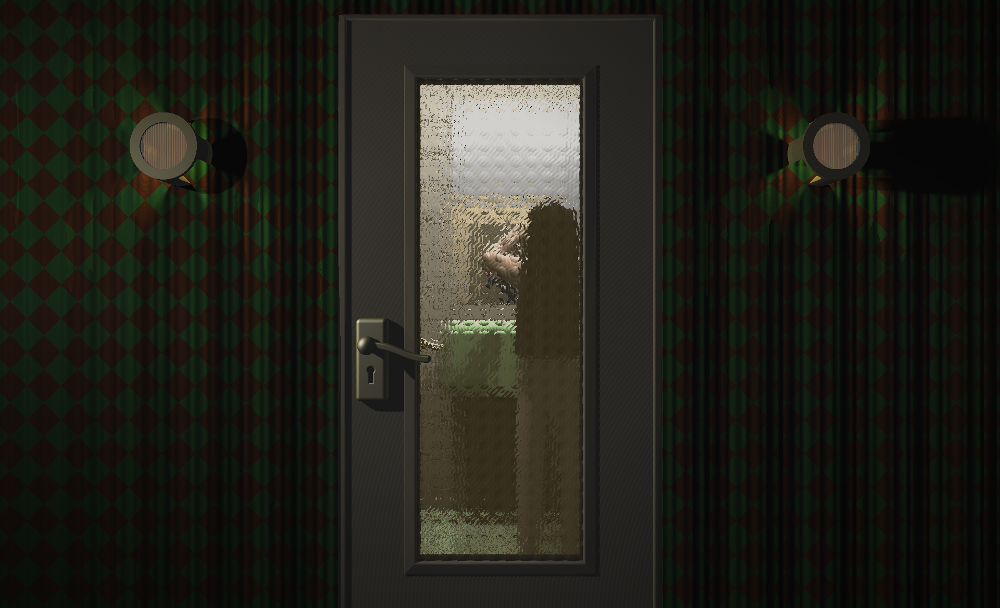

# Grand Motel (Executable Graphics)

This was my entry for the 4k Executable graphics competition at the [Black Valley 2025](https://2025.blackvalley.party) demoparty, where it placed 1st out of 3 entries. The competition requires that the executable is a maximum of 4096 bytes.

Black Valley is the annual Norwegian [demoscene](https://en.wikipedia.org/wiki/Demoscene) event.

The program started out as an experiment with transparency and [refraction](https://en.wikipedia.org/wiki/Refraction) using OpenGL shaders. The image is rendered using [ray marching](https://iquilezles.org/articles/raymarchingdf/).

It was originally made for the [Revision 2025](https://2025.revision-party.net/) demoparty, but it failed to run on the competition machine due to an Nvidia driver bug.

